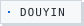
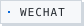

<!--
  This page is generated, not hand-maintained.

  Every image under assets/generated/ comes out of `node scripts/build.mjs`.
  Each one exists in four versions — desktop/phone x light/dark — and the
  <picture> blocks below pick between them. Source order matters, first match
  wins:

      1. (max-width: 500px) and (prefers-color-scheme: dark)   phone,   dark
      2. (max-width: 500px)                                    phone,   light
      3. (prefers-color-scheme: dark)                          desktop, dark
      4.                                              desktop, light

  Phone versions are real narrow layouts, not the desktop file scaled: an 824px
  panel squeezed into a 344px column renders 11px type at 4.6px.

  Each <a> has to stay on ONE line. Broken across lines, the markdown parser
  closes the inline context and side-by-side cards stop flowing together.

  The design system these are built against — type ladder, spacing scale,
  colour budget, motion rules, and the measured values they came from — is
  written down in DESIGN.md. To change wording, edit scripts/config.json and
  rebuild; editing an SVG by hand will be overwritten by the next scheduled run.
-->

<picture>
  <source media="(max-width: 500px) and (prefers-color-scheme: dark)" srcset="assets/generated/hero-m-dark.svg">
  <source media="(max-width: 500px)" srcset="assets/generated/hero-m-light.svg">
  <source media="(prefers-color-scheme: dark)" srcset="assets/generated/hero-dark.svg">
  
</picture>

<!-- ═══ 01 // ABOUT ME ═══════════════════════════════════════════════════ -->

<picture>
  <source media="(max-width: 500px) and (prefers-color-scheme: dark)" srcset="assets/generated/sec-01-m-dark.svg">
  <source media="(max-width: 500px)" srcset="assets/generated/sec-01-m-light.svg">
  <source media="(prefers-color-scheme: dark)" srcset="assets/generated/sec-01-dark.svg">
  
</picture>

<picture>
  <source media="(max-width: 500px) and (prefers-color-scheme: dark)" srcset="assets/generated/about-m-dark.svg">
  <source media="(max-width: 500px)" srcset="assets/generated/about-m-light.svg">
  <source media="(prefers-color-scheme: dark)" srcset="assets/generated/about-dark.svg">
  
</picture>

<!-- ═══ 02 // THROUGH MY LENS ════════════════════════════════════════════
     Hidden until the real photographs are in assets/photography/. The section
     is deliberately absent rather than showing a placeholder or a "coming
     soon" card. sec-02 is already generated and waiting.
     ═══════════════════════════════════════════════════════════════════════ -->

<!-- ═══ 03 // SELECTED WORK ══════════════════════════════════════════════ -->

<picture>
  <source media="(max-width: 500px) and (prefers-color-scheme: dark)" srcset="assets/generated/sec-03-m-dark.svg">
  <source media="(max-width: 500px)" srcset="assets/generated/sec-03-m-light.svg">
  <source media="(prefers-color-scheme: dark)" srcset="assets/generated/sec-03-dark.svg">
  
</picture>

<a href="https://github.com/yunmin311/context-distiller"><picture><source media="(max-width: 500px) and (prefers-color-scheme: dark)" srcset="assets/generated/work-context-distiller-m-dark.svg"><source media="(max-width: 500px)" srcset="assets/generated/work-context-distiller-m-light.svg"><source media="(prefers-color-scheme: dark)" srcset="assets/generated/work-context-distiller-dark.svg"></picture></a>
<a href="https://github.com/yunmin311/governance-framework"><picture><source media="(max-width: 500px) and (prefers-color-scheme: dark)" srcset="assets/generated/work-governance-framework-m-dark.svg"><source media="(max-width: 500px)" srcset="assets/generated/work-governance-framework-m-light.svg"><source media="(prefers-color-scheme: dark)" srcset="assets/generated/work-governance-framework-dark.svg"></picture></a>
<a href="https://github.com/yunmin311/window-annotator"><picture><source media="(max-width: 500px) and (prefers-color-scheme: dark)" srcset="assets/generated/work-window-annotator-m-dark.svg"><source media="(max-width: 500px)" srcset="assets/generated/work-window-annotator-m-light.svg"><source media="(prefers-color-scheme: dark)" srcset="assets/generated/work-window-annotator-dark.svg"></picture></a>
<a href="https://github.com/yunmin311/work-capsule"><picture><source media="(max-width: 500px) and (prefers-color-scheme: dark)" srcset="assets/generated/work-work-capsule-m-dark.svg"><source media="(max-width: 500px)" srcset="assets/generated/work-work-capsule-m-light.svg"><source media="(prefers-color-scheme: dark)" srcset="assets/generated/work-work-capsule-dark.svg"></picture></a>

<!-- ═══ 04 // HOW I WORK ═════════════════════════════════════════════════ -->

<picture>
  <source media="(max-width: 500px) and (prefers-color-scheme: dark)" srcset="assets/generated/sec-04-m-dark.svg">
  <source media="(max-width: 500px)" srcset="assets/generated/sec-04-m-light.svg">
  <source media="(prefers-color-scheme: dark)" srcset="assets/generated/sec-04-dark.svg">
  
</picture>

<picture>
  <source media="(max-width: 500px) and (prefers-color-scheme: dark)" srcset="assets/generated/rhythm-m-dark.svg">
  <source media="(max-width: 500px)" srcset="assets/generated/rhythm-m-light.svg">
  <source media="(prefers-color-scheme: dark)" srcset="assets/generated/rhythm-dark.svg">
  
</picture>

<picture>
  <source media="(max-width: 500px) and (prefers-color-scheme: dark)" srcset="assets/generated/languages-m-dark.svg">
  <source media="(max-width: 500px)" srcset="assets/generated/languages-m-light.svg">
  <source media="(prefers-color-scheme: dark)" srcset="assets/generated/languages-dark.svg">
  
</picture>

<a href="https://github.com/yunmin311?tab=stars"><picture><source media="(max-width: 500px) and (prefers-color-scheme: dark)" srcset="assets/generated/stars-m-dark.svg"><source media="(max-width: 500px)" srcset="assets/generated/stars-m-light.svg"><source media="(prefers-color-scheme: dark)" srcset="assets/generated/stars-dark.svg"></picture></a>
<picture><source media="(max-width: 500px) and (prefers-color-scheme: dark)" srcset="assets/generated/activity-m-dark.svg"><source media="(max-width: 500px)" srcset="assets/generated/activity-m-light.svg"><source media="(prefers-color-scheme: dark)" srcset="assets/generated/activity-dark.svg"></picture>

<!-- ═══ 05 // CONTRIBUTIONS ══════════════════════════════════════════════ -->

<picture>
  <source media="(max-width: 500px) and (prefers-color-scheme: dark)" srcset="assets/generated/sec-05-m-dark.svg">
  <source media="(max-width: 500px)" srcset="assets/generated/sec-05-m-light.svg">
  <source media="(prefers-color-scheme: dark)" srcset="assets/generated/sec-05-dark.svg">
  
</picture>

<picture>
  <source media="(max-width: 500px) and (prefers-color-scheme: dark)" srcset="assets/generated/contributions-m-dark.svg">
  <source media="(max-width: 500px)" srcset="assets/generated/contributions-m-light.svg">
  <source media="(prefers-color-scheme: dark)" srcset="assets/generated/contributions-dark.svg">
  
</picture>

<!-- ═══ 06 // AESTHETIC INPUTS ═══════════════════════════════════════════ -->
<!-- AESTHETIC_INPUTS_SLOT -->

<!-- ═══ 07 // CONTACT ════════════════════════════════════════════════════ -->

<picture>
  <source media="(max-width: 500px) and (prefers-color-scheme: dark)" srcset="assets/generated/sec-07-m-dark.svg">
  <source media="(max-width: 500px)" srcset="assets/generated/sec-07-m-light.svg">
  <source media="(prefers-color-scheme: dark)" srcset="assets/generated/sec-07-dark.svg">
  
</picture>

<!-- A README cannot run script, so click-to-copy is not possible on this page.
     EMAIL hands the click to the reader's mail client without printing the
     address as text. WECHAT opens a QR with the avatar, display name and city
     stripped off it. WEBSITE stays out until yunmin311.github.io serves
     something — it currently 404s. -->
<a href="mailto:liqiyu311@gmail.com"><picture><source media="(prefers-color-scheme: dark)" srcset="assets/generated/btn-email-dark.svg"></picture></a>
<a href="https://www.douyin.com/user/MS4wLjABAAAACCMGACneEnYcKlqMPe5wKvyxkUQTcX39bBzWcbGbpBSfWN4hHKN0dnZc64sV6SHR"><picture><source media="(prefers-color-scheme: dark)" srcset="assets/generated/btn-douyin-dark.svg"></picture></a>
<a href="assets/contact/wechat-qr.png"><picture><source media="(prefers-color-scheme: dark)" srcset="assets/generated/btn-wechat-dark.svg"></picture></a>

<!-- ═══ 08 // FORTUNE ════════════════════════════════════════════════════ -->

<picture>
  <source media="(max-width: 500px) and (prefers-color-scheme: dark)" srcset="assets/generated/sec-08-m-dark.svg">
  <source media="(max-width: 500px)" srcset="assets/generated/sec-08-m-light.svg">
  <source media="(prefers-color-scheme: dark)" srcset="assets/generated/sec-08-dark.svg">
  
</picture>

<picture>
  <source media="(max-width: 500px) and (prefers-color-scheme: dark)" srcset="assets/generated/fortune-m-dark.svg">
  <source media="(max-width: 500px)" srcset="assets/generated/fortune-m-light.svg">
  <source media="(prefers-color-scheme: dark)" srcset="assets/generated/fortune-dark.svg">
  
</picture>

