<!--
  This page is generated, not hand-maintained.

  Every image under assets/generated/ comes out of `node scripts/build.mjs`,
  one file per theme, paired below with <picture> so GitHub can pick. The design
  system they are built against — type ladder, spacing scale, colour budget, and
  the measured sources it came from — is written down in DESIGN.md.

  To change wording, edit scripts/config.json and rebuild. Editing an SVG by
  hand will be overwritten by the next scheduled run.
-->

<picture>
  <source media="(prefers-color-scheme: dark)" srcset="assets/generated/hero-dark.svg">
  
</picture>

<!-- ═══ 01 // ABOUT ME ═══════════════════════════════════════════════════ -->

<picture>
  <source media="(prefers-color-scheme: dark)" srcset="assets/generated/sec-01-dark.svg">
  
</picture>

Hi, I'm **Qiyu Li**.

I build AI-native tools and creative software around **thinking, creating, and working with AI** — mostly around human–AI interaction, visual systems, and turning messy ideas into things that actually work.

Outside the editor you'll usually find me around **photography, films, table tennis**, and whatever I'm curious about next.

<picture>
  <source media="(prefers-color-scheme: dark)" srcset="assets/generated/about-meta-dark.svg">
  
</picture>

<!-- ═══ 02 // THROUGH MY LENS ════════════════════════════════════════════
     Hidden until the real photographs are in assets/photography/.
     `node scripts/build-lens.mjs` builds the contact sheet from whatever is
     in that folder; the section is deliberately absent rather than showing a
     placeholder or a "coming soon" card.

<picture>
  <source media="(prefers-color-scheme: dark)" srcset="assets/generated/sec-02-dark.svg">
  
</picture>

<picture>
  <source media="(prefers-color-scheme: dark)" srcset="assets/generated/lens-dark.svg">
  
</picture>

     ═══════════════════════════════════════════════════════════════════════ -->

<!-- ═══ 03 // SELECTED WORK ══════════════════════════════════════════════ -->

<picture>
  <source media="(prefers-color-scheme: dark)" srcset="assets/generated/sec-03-dark.svg">
  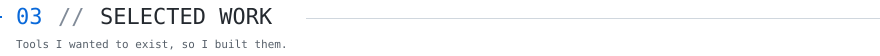
</picture>

<!-- Side-by-side images rather than a table: a table forces a horizontal
     scrollbar on a phone, whereas inline images simply wrap and stack. -->
<a href="https://github.com/yunmin311/context-distiller"><picture>
  <source media="(prefers-color-scheme: dark)" srcset="assets/generated/work-context-distiller-dark.svg">
  
</picture></a>
<a href="https://github.com/yunmin311/governance-framework"><picture>
  <source media="(prefers-color-scheme: dark)" srcset="assets/generated/work-governance-framework-dark.svg">
  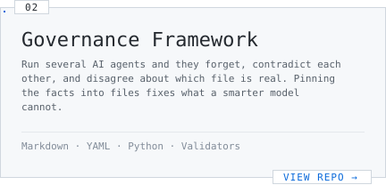
</picture></a>
<a href="https://github.com/yunmin311/window-annotator"><picture>
  <source media="(prefers-color-scheme: dark)" srcset="assets/generated/work-window-annotator-dark.svg">
  
</picture></a>
<a href="https://github.com/yunmin311/work-capsule"><picture>
  <source media="(prefers-color-scheme: dark)" srcset="assets/generated/work-work-capsule-dark.svg">
  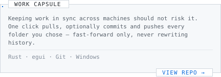
</picture></a>

<!-- ═══ 04 // HOW I WORK ═════════════════════════════════════════════════ -->

<picture>
  <source media="(prefers-color-scheme: dark)" srcset="assets/generated/sec-04-dark.svg">
  
</picture>

<picture>
  <source media="(prefers-color-scheme: dark)" srcset="assets/generated/rhythm-dark.svg">
  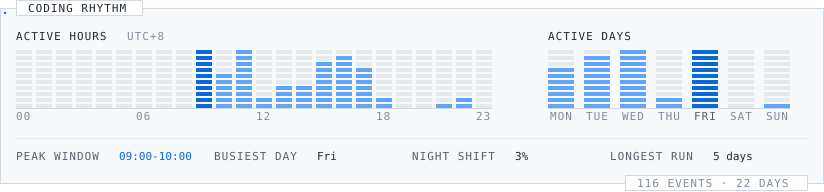
</picture>

<picture>
  <source media="(prefers-color-scheme: dark)" srcset="assets/generated/languages-dark.svg">
  
</picture>

<picture>
  <source media="(prefers-color-scheme: dark)" srcset="assets/generated/stars-dark.svg">
  
</picture>
<picture>
  <source media="(prefers-color-scheme: dark)" srcset="assets/generated/activity-dark.svg">
  
</picture>

<!-- ═══ 05 // CONTRIBUTIONS ══════════════════════════════════════════════ -->

<picture>
  <source media="(prefers-color-scheme: dark)" srcset="assets/generated/sec-05-dark.svg">
  
</picture>

<picture>
  <source media="(prefers-color-scheme: dark)" srcset="assets/generated/contributions-dark.svg">
  
</picture>

<!-- ═══ 06 // AESTHETIC INPUTS ═══════════════════════════════════════════ -->
<!-- AESTHETIC_INPUTS_SLOT -->

<!-- ═══ 07 // CONTACT ════════════════════════════════════════════════════ -->

<picture>
  <source media="(prefers-color-scheme: dark)" srcset="assets/generated/sec-07-dark.svg">
  
</picture>

<a href="mailto:liqiyu311@gmail.com"><picture>
  <source media="(prefers-color-scheme: dark)" srcset="assets/generated/btn-email-dark.svg">
  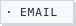
</picture></a>
<!-- TODO(contact): DOUYIN, WECHAT and WEBSITE buttons are built and waiting in
     scripts/config.json — flip `enabled` once there is a real Douyin URL, a QR
     to link to, and a live site. A README cannot run script, so click-to-copy
     needs the small contact page in docs/ and GitHub Pages switched on for
     this repository; then set contactPage.enabled and rebuild. Nothing here is
     guessed and nothing is shown that does not resolve. -->

<!-- ═══ 08 // FORTUNE ════════════════════════════════════════════════════ -->

<picture>
  <source media="(prefers-color-scheme: dark)" srcset="assets/generated/sec-08-dark.svg">
  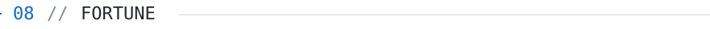
</picture>

<picture>
  <source media="(prefers-color-scheme: dark)" srcset="assets/generated/fortune-dark.svg">
  
</picture>
