# Components

Every panel on this profile is a small generator: it takes a theme, some data
and a config block, and returns one SVG. They are listed here so the useful ones
can be lifted out — the design system carries over with them, because all of it
lives in `scripts/lib/`.

Nothing here needs a build step, a package manager or a runtime. `node` and
`git` are the whole toolchain.

---

## How a component works

```js
// scripts/panels/<name>.mjs
export const id = "thing"          // filename stem for the output
export const responsive = true     // also emit a 284px phone variant

export function render(theme, ctx, cfg, { mobile }) {
  return { w, h, body, css, title } // title becomes the alt text
}

export const build = (t, ctx, cfg, v) => {
  const r = render(t, ctx, cfg, v)
  return svgDoc({ ...r, theme: t, bleed: SHADOW })
}
```

Register it in the `PANELS` array in `scripts/build.mjs` and it starts producing
`<id>-dark.svg`, `<id>-light.svg` and the two phone variants. There is no other
wiring.

**Four rules the shared layer enforces.** They are the difference between a set
of parts and a pile of widgets:

1. **Type is 11px or 22px, nothing between.** The face is drawn on an 11-pixel
   em, so only multiples of 11 land glyph edges on whole pixels.
2. **Chrome is a multiple of 2px.** Things get bigger by taking more cells.
3. **Type must stay under 6% of the width of the box it sits in.** Sized against
   the canvas instead, a number that looks fine alone collides in place.
4. **Motion animates `transform` only, never `opacity`.** An ``-loaded SVG
   does not reliably start its animations; an effect that begins at zero opacity
   can leave a panel permanently blank.

Full reasoning, and the measured values behind them, in [DESIGN.md](../DESIGN.md).

---

## In use on the profile

| component | what it is | needs |
|---|---|---|
| `hero` | typewriter over three lines | config only |
| `about` | name, prose, chips, principles | config only |
| `sections` | numbered section rules | config only |
| `work` | project card, one link per card | config only |
| `rhythm` | segmented hour and weekday meters | public events feed |
| `languages` | authored-line share, from a real clone | `git` + repo list |
| `stars` | recently starred, with a list rail | starred API |
| `activity` | releases, issues, PRs — never pushes | public events feed |
| `contributions` | a year as a filled field | GraphQL calendar |
| `fortune` | one rotating line | config only |
| `contact` | keycap buttons, no brand colours | config only |

## Available, not used here

These are built on every run and shown below. Nothing on the profile references
them — they exist so a fork has parts to build with.

### display — oversized pixel headline

<picture>
  <source media="(prefers-color-scheme: dark)" srcset="../assets/generated/display-dark.svg">
  
</picture>

Three treatments: `solid`, `hollow` and `shadow`. Hollow is a stroke on a bitmap
face, which traces every step in the glyph — that is why it reads as pixel art
rather than as an outlined font. Sizes are 33 / 44 / 55, picked automatically
from the text length; anything between those puts glyph edges on fractions.

```json
"display": { "text": "PIXEL", "treatment": "hollow", "colour": "ink", "sweep": true }
```

### tiles — a row of readout cells

<picture>
  <source media="(prefers-color-scheme: dark)" srcset="../assets/generated/tiles-dark.svg">
  
</picture>

Separate framed boxes rather than one divided panel, so the row survives
wrapping onto a phone. Each tile's lamp takes its turn.

```json
"tiles": [{ "label": "SHIPPED", "value": "4 tools", "note": "MIT" }]
```

### quote — a framed statement

<picture>
  <source media="(prefers-color-scheme: dark)" srcset="../assets/generated/quote-dark.svg">
  
</picture>

The blue spine sits *inside* the frame. A coloured stripe down the outside edge
of a card is the single most reached-for way to make a block look designed, and
it is on the anti-AI-taste list for exactly that reason.

```json
"quote": { "text": "…", "by": "…" }
```

---

## Primitives worth stealing

In `scripts/lib/design.mjs`:

| | |
|---|---|
| `pixelFrame` | a border with stepped corners — a grid cannot curve, so it steps |
| `pixelRule` | a divider made of blocks rather than a hairline |
| `pixelCaret` | a stacked-block pointer. **Archived**: not used on the profile, because a free-floating arrow has no structural anchor and every position looked slightly wrong. Good for something that *does* have an anchor — a menu, a single highlighted item, a prompt |
| `listRail` | a track down a list's margin with one lit segment exactly one row tall. What replaced the caret: alignment is geometry, not judgement |
| `tab` | a label plate riveted onto a frame rather than punched through it |
| `panel` | the three-zone anatomy — top rail, content, bottom rail |
| `readout` | a label/value pair that stays together |

In `scripts/lib/motion.mjs` — entrance effects (`rise`, `grow`, `fill`, `draw`)
and ambient ones (`lamp`, `tick`, `stream`, `playhead`, `cursor`, `flicker`,
`ants`, `wave`, `pixelWave`). Every one is switchable per component and every one
respects `prefers-reduced-motion`.

## Type

Departure Mono (SIL OFL, Helena Zhang), subset to about 2 KB and embedded as a
data URI in every file. An SVG shown through `` cannot fetch an external
font, so embedding is the only way to control type at all. The licence travels
with it in `assets/fonts/OFL.txt`; it declares no reserved font name, which is
why the subset can keep the original name — checked in the licence text, not in
the binary, because a subset binary has its name table stripped.
